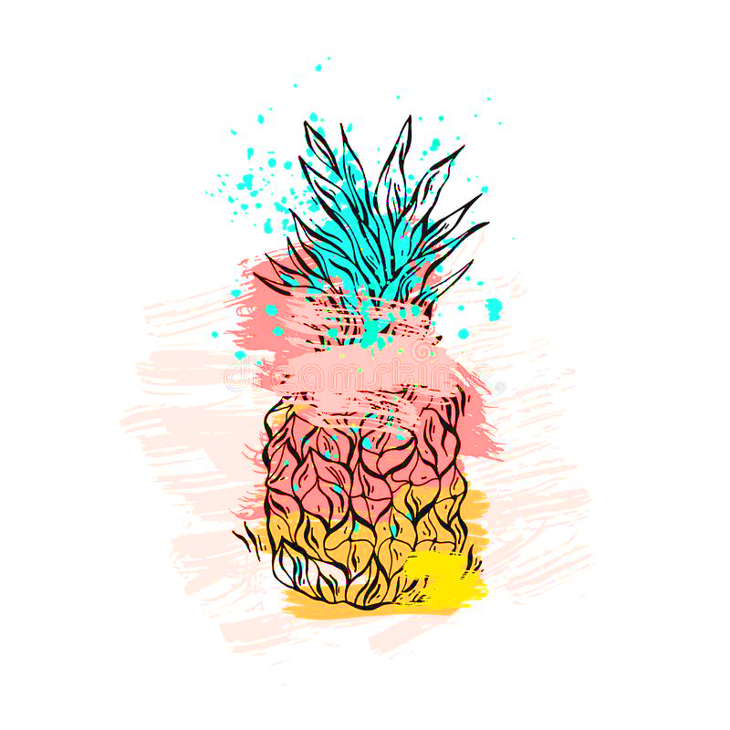

En este ejemplo, ya tenemos creada en el HTML casi toda la estructura de las cartas.

Por ejemplo vamos a tener 12 veces algo como lo siguiente.

```html
<div class="cards">
  <div class="card-tapada">
    
  </div>
</div>
```

Lo que necesitamos hacer es obtener cada uno de los divs con la clase `.card` y agregarles el segundo div restante.
Elemento a crear:
```html
<div class="card-destapada">
  
</div>
```

A la imagen dentro de este div que creamos tenemos que configurarle el atributo `src` que por ahora no lo pusimos. El `src` de cada imagen lo vamos a asignar aleatoriamente de nuestras imágenes.